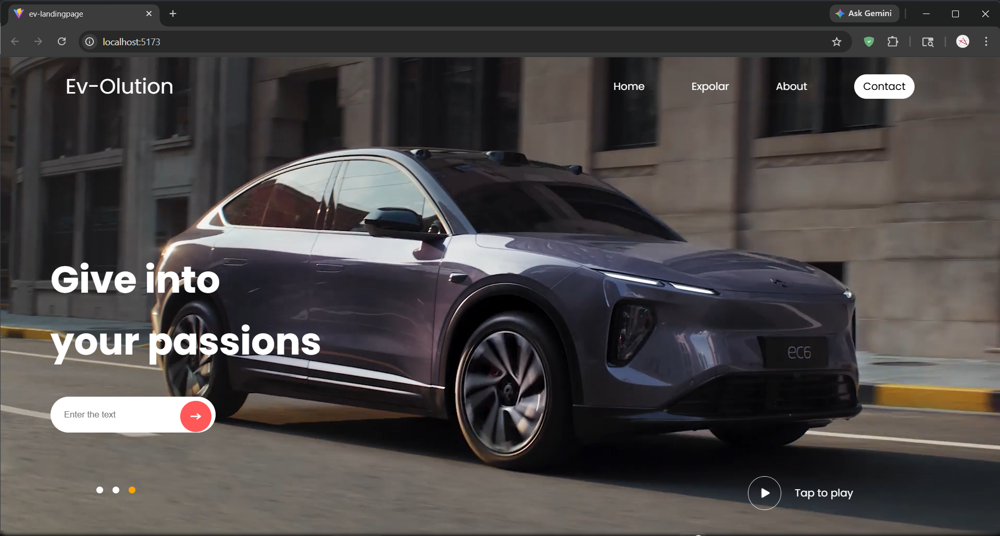

# ⚡ EV Landing Page Design

A simple and modern **Electric Vehicle (EV) landing page** built using React and CSS.  
This project focuses on learning **React fundamentals and UI design basics**.

---

## 📌 About the Project

This is a beginner-friendly frontend project created to practice:

- Building UI with React components
- Understanding JSX and component structure
- Styling using CSS
- Creating responsive layouts

The landing page represents a clean design for an EV product/brand.

---

## 🚀 Features

- ⚛️ Built with React
- 🎨 Custom CSS styling
- 📱 Responsive design (mobile-friendly)
- 🧩 Reusable components
- 💡 Clean and minimal UI

---

## 🛠️ Tech Stack

- React.js
- JavaScript (ES6+)
- HTML5
- CSS3

---

## 📂 Project Structure
ev-landing-design/
│── public/
│── src/
│ ├── components/
│ ├── App.js
│ ├── index.js
│── package.json

---

🖼️ Preview  


---

## 🖥️ Installation & Setup

Follow these steps to run the project locally:

```bash
# Clone the repository
git clone https://github.com/Antriksh96/ev-landing-design.git

# Navigate into the folder
cd ev-landing-design

# Install dependencies
npm install

# Run the project
npm start

----

🎯 Learning Outcomes

Through this project, I learned:

Basics of React (components & structure)
Styling using CSS
Building a simple landing page UI
Organizing frontend code
